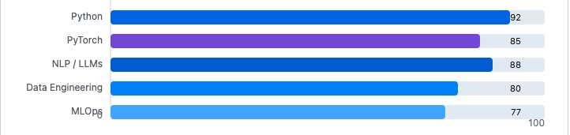

<!-- COVER / HIGHLIGHT -->

  

<!-- HERO -->

  <h1>Ahmer Jamil</h1>
  
<b>PhD (Fault Tolerance) • ML Engineer • Data Scientist</b>

  

    
    
    
    
  

  

    
    
    
  

<!-- TAGLINE -->

  Graduate student @ <b>University of Florida</b> • Former Data Scientist / ML Engineer @ <b>Systems Limited</b>  
  I build <b>LLM</b> + <b>ML</b> solutions powered by clean data, pragmatic MLOps, and measurable business impact.

<!-- QUICK FACTS -->

  
  
  
  
  
  
  
  

<!-- ABOUT -->
<h2>👋 About Me</h2>
<ul>
  <li><b>PhD student</b> in Fault Tolerance in High Performance Computing at the <b>University of Florida</b>.</li>
  <li>Previously: Data Scientist / ML Engineer @ <b>Systems Limited</b>, delivering LLM/RAG and classic ML solutions for global clients.</li>
  <li>I enjoy bridging <b>product</b> ↔ <b>ML systems</b>—from data pipelines → modeling → evaluation → deployment.</li>
  <li>Read more in my <a href="Ahmer_Jamil.pdf"><b>CV / Resume</b></a>.</li>
</ul>

<!-- LIVE CARDS -->
<h2>📊 At a Glance</h2>

  
  

  

<!-- SKILL SNAPSHOT -->
<h2>🧠 Skill Snapshot</h2>

Relative comfort across my day-to-day stack (toy visualization):

  

<!-- PROJECT HIGHLIGHTS -->
<h2>🚀 Selected Work</h2>
<table>
  <tr>
    <td width="30%">
      
    </td>
    <td>
      <h3>Chatbot Creation (LLMs + RAG)</h3>
      <ul>
        <li>Domain-grounded assistants using retrieval augmentation (vector & hybrid search).</li>
        <li>Prompt engineering & guardrails for safe, helpful responses.</li>
        <li>Evaluation for groundedness, latency, and task success.</li>
      </ul>
    </td>
  </tr>
  <tr>
    <td>
      
    </td>
    <td>
      <h3>Customer Profiling (Classification)</h3>
      <ul>
        <li>Supervised learning on behavioral & demographic features.</li>
        <li>Calibrated probabilities & tree ensembles for segmentation.</li>
        <li>Feature importance & SHAP to inform marketing actions.</li>
      </ul>
    </td>
  </tr>
  <tr>
    <td>
      
    </td>
    <td>
      <h3>Customer Churn Prediction</h3>
      <ul>
        <li>Time-aware features (RFM, tenure, ticket history).</li>
        <li>Pipeline: data cleaning → modeling → uplift analysis for retention.</li>
        <li>Monitored drift & cohort shifts in production.</li>
      </ul>
    </td>
  </tr>
  <tr>
    <td>
      
    </td>
    <td>
      <h3>Fault Tolerance in HPC (ML + GNN)</h3>
      <ul>
        <li>Graph modeling of program IR & data dependencies (GraphSAGE/GIN).</li>
        <li>Predicting silent data corruption (SDC) & propagation risk.</li>
        <li>PhD research focus: reliability insights to prioritize hardening/testing in HPC pipelines.</li>
      </ul>
    </td>
  </tr>
</table>

<!-- CONTACT -->
<h2>🤝 Let’s Connect</h2>

  I’m open to roles and collaborations in <b>ML Engineering</b>, <b>LLMs/RAG</b>, and <b>Data Science</b>.
   Reach me at <a href="mailto:ahmerjamil.aj@gmail.com">ahmerjamil.aj@gmail.com</a> or on <a href="https://www.linkedin.com/in/ahmer-jamil582000">LinkedIn</a>.

